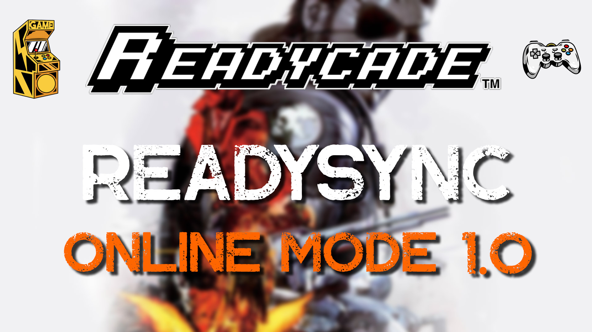

# ReadySync (Online Mode)
## (Ready... Set... Play!)

Mounts any HTTP/FTP repository of Romsets giving you an Online and Offline experience.

It uses rclone to mount any HTTP/FTP directory to your Readycade and makes it playable almost instantly.

It uses httpdirfs to mount the thumbnails from https://thumbnails.libretro.com

It uses zip-mount to mount .zip's to /iso when the emulator doesn't support .zip files (eg. arduboy, gamecube, ps2, wii.. ect)

## Click the Picture below to Watch the ReadySync (Online Mode) YouTube Video
[](https://www.youtube.com/watch?v=6dR_I5IsSRE)


## INSTALLATION

### Recalbox 9.2+ Supported ONLY:

Download **custom.sh** and place it in **/recalbox/share/system**
```
eg: /recalbox/share/system/custom.sh
```
OR

Login to your recalbox via ssh (Open a **Command Prompt** on **windows** or **terminal** on **linux/mac**)

**login username and host:**
```
root@recalbox
```
**password:**
```
recalboxroot
```
**Run the command to download the custom.sh script**
```
wget -O /recalbox/share/system/custom.sh https://raw.githubusercontent.com/readycade/readysync/master/share/system/custom.sh && chmod +x /recalbox/share/system/custom.sh
```

#### Running the command from the terminal (ADVANCED USERS ONLY)
This will start the **custom.sh** script located in /recalbox/share/system

**IMPORTANT** Remember to **press B** repeatedly for **10-15 seconds** immediately after you run the below command

```
/etc/init.d/S99custom start
```

### The script will run on **every boot**.
Offline will be **ALWAYS** selected if you **do not** press anything during **startup**)

### Selecting Online or Offline Mode (**Offline** is default)
Power on your **Readycade** and wait until after seeing "Booting Recalbox... **press B** repeatedly for **10-15 seconds**"

### Known Supported Controllers:
DragonArcade Joystick/Buttons<br>
Sony Playstation 4<br>
Microsoft Xbox 360 (Wired)<br>
8bitdo Ultimate Controller (Wired)<br>
Standard Keyboard (Press 1 instead of B)<br>

### If you want the Whole Enchilada (ALL THE GAMES)
You will need to edit the custom.sh file
**ALL TOSEC romsets** will be **disabled** by default to make things snappy.

## IMPORTANT

**Amstrad CPC** is **DISABLED**.
```
[amstradcpc]=disabled
```
**Atari 8bit** is **ENABLED**.
```
[atari800]=enabled
```

### Using the terminal to edit the file
```
nano /recalbox/share/system/custom.sh
```

make your changes to the **TOSEC romsets** you wish to **enable** or **disable**.

To save your changes press **CTRL+X** then Press **Y** then Press **Enter**.

Run the Script again to **download** your **enabled TOSEC** romsets.

```
/etc/init.d/S99custom start
```

The script should work **automagically**, but incase nothing happens the first time.. it's most likely due to your **internet connection** not being able to download all of the required files in a timely manner. In this case run the script a couple times in the terminal (Remember to press B immediately after running the script):

### Check the Progress of the script here:

```
/recalbox/share/system/.systemstream.log
```

After installation is complete. Enable online mode again and give it a few moments to update the gameslist.
Your new TOSEC romsets should appear now.

### Notes:
Default **gamelist.xml's** and **checksums** are provided for **ALL consoles**.

### Selecting Online or Offline Mode (**Offline** is default)
**press B** repeatedly for **10-15 seconds**"

### Long Loading Times
If you only use **No-Intro** and **Redump** the boot time should be under **1 minute**.

Enabling larger **TOSEC romsets** will take **longer to mount**. ex: **amstradcpc, gx4000, zxspectrum...**

### MORE PROBLEMS?!?!?!
If you experience any OTHER issues, **DELETE** everything in **/recalbox/share/userscripts/.config/readystream** and **restart** your **Readycade**.

### Flowchart (Visual Representation)

