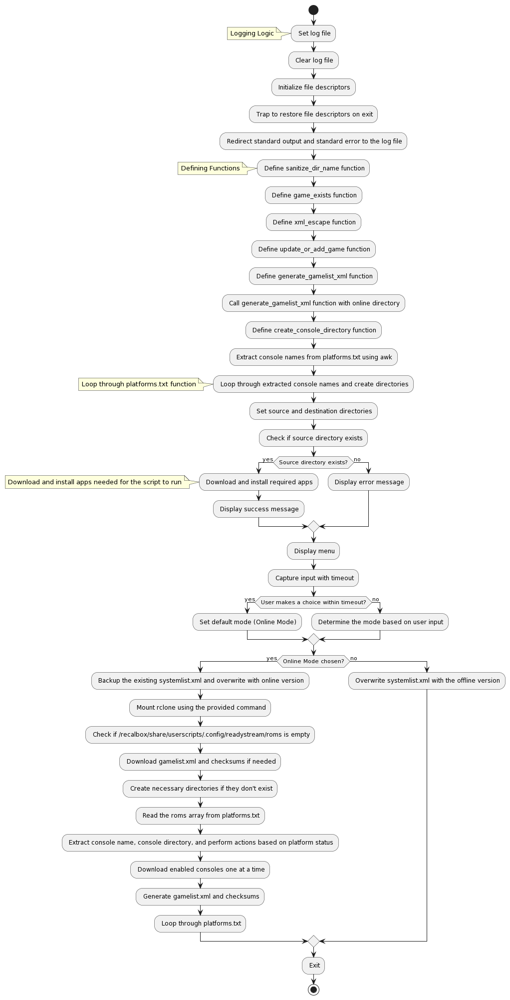

# Readystream (Ready... Set... Play!)

Essentially what the script does is offer you an OFFLINE and ONLINE way of playing games.

It rsync's whatever online Rsync directory to your arcade (Recalbox) and makes it playable almost instantly.

It rclone's the thumbnails from libretro and generates gamelist.xml's with update functionality.

We use zip-mount to mount .zip's when the emulator doesn't support .zip's (eg. arduboy, gamecube, ps2, wii.. ect)


## INSTALLATION

Download custom.sh and place it in /recalbox/share/system
```
eg: /recalbox/share/system/custom.sh
```

The script will run on every boot.


### If you wish to run the script manually..

login to your recalbox via ssh

```
root@recalbox
```
and run the command below from the terminal
```
/etc/init.d/S99custom start
```

#### Log File:
```
/recalbox/share/system/.systemstream.log
```
Enabled Consoles - Download romsets via rsync in alphabetical order (syncing may take time depending on how large the romset is)

## Notes:
Default gamelist.xml's and checksums are provided..
The script is smart enough to notice changes and update your gamelist.xml and checksum

Disabled Consoles - Previously downloaded romsets be deleted when the script is run again (or on next reboot)

in the custom.sh file you can Enable/Disable consoles you wish to download... and also change which mode you are in.
```
# List of platforms and their status (1 for enabled, 0 for disabled)
platforms=(
    "arduboy 1"
    "channelf 0"
    "vectrex 0"
    "o2em 0"
    "videopacplus 0"
    "intellivision 0"
    # And More...
    # Zip Array
    "pet 0"
    "pc88 0"
    "pc98 0"
    # And More
)
```
----------------------------------------------------------------------------------------
Selecting Online or Offline Mode (Offline is default)
----------------------------------------------------------------------------------------
```
# Capture input with timeout (Change mode_choice="2" to "1" if you wish to enable Online Mode
read -t "$timeout_seconds" -r input || mode_choice="2"
----------------------------------------------------------------------------------------
```
## Flowchart (Visual Representation)

